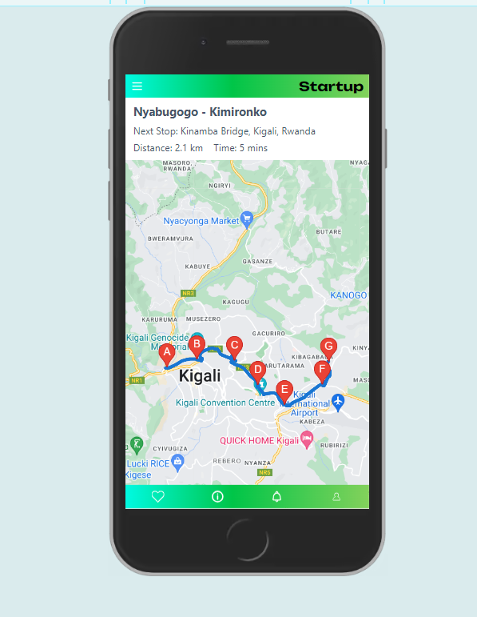

# GEOLOCATION WEB APP 🚌🗺

## Overview
This is a simple webpage that utilizes the Google Maps API
to navigate a popular bus route in Kigali( Nyabugogo to Kimironko ). 

## Features
This web page displays the estimated time and distance to reach each  upcoming
stop set in a particular route.


## Usage Description
>This app will be mainly used by >drivers to effectively cruise through >their routes without missing a bus stop.

## Technologies Used

`React`: Frontend frameworks

`Vite`: Fast build tool and development server for modern web applications

`Google Maps API`: Maps API to add mapping and routing functionalities.

## Running the project

``` git clone ```

``` cd geolocation-webPage```

``` pnpm install ```

``` pnpm run dev```